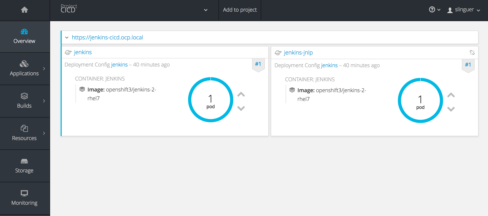
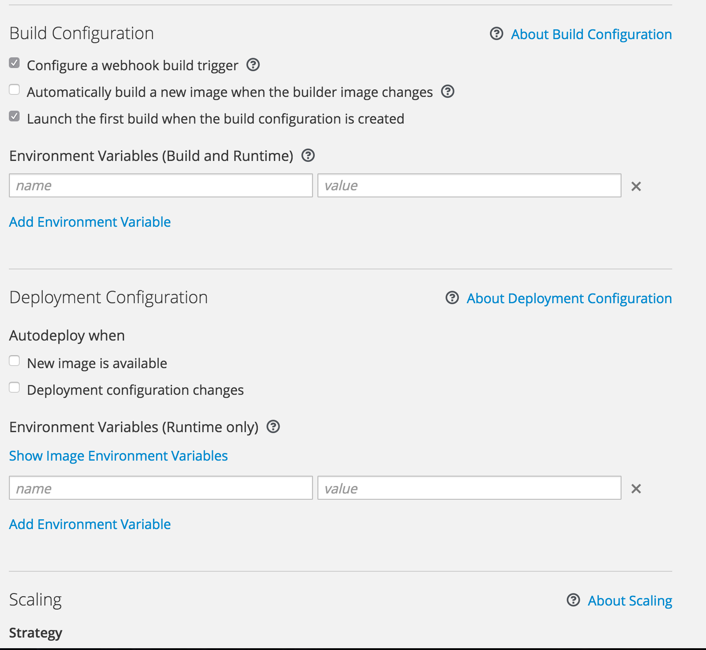
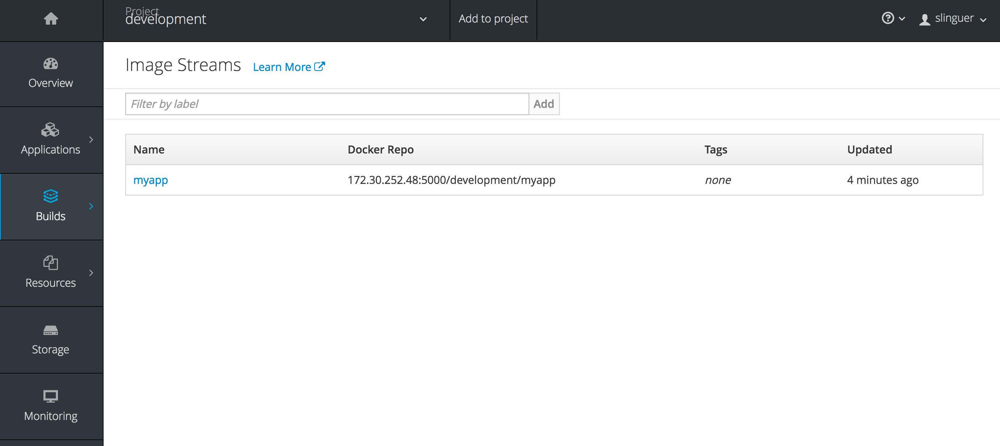

The base Tutorial is from:

https://github.com/VeerMuchandi/pipeline-example


# First simple Pipeline

Create a new project on Openshift "CICD"

On this project copy & paste the YAML:

https://raw.githubusercontent.com/VeerMuchandi/pipeline-example/master/pipeline.yml

Wait for the jenkins pods to be up and running 



Now you can click on the route.

Now you can login in jenkins with SSO using your OCP infrastructure.

The first time you login OCP ask you ro allow jenkins to access your projects/namespace.

(otherwise you have to use the oc/oadm commands to enable users groups)

Allow and go on.

Now add a new app to CICD projects

Config the app disabling automatic build and deploy




# Managing pipeline across projects

Ve will create two stages:

- development

- testing

We started with:

```
node('maven') {
	stage 'build'
	openshiftBuild(buildConfig: 'myphp', showBuildLogs: 'true')
	stage 'deploy'
	openshiftDeploy(deploymentConfig: 'myphp')
	openshiftScale(deploymentConfig: 'myphp',replicaCount: '2')
}
```

We will update to:

```
node('maven') {
	stage 'buildInDevelopment'
	openshiftBuild(namespace: 'development', buildConfig: 'myapp', showBuildLogs: 'true')
	stage 'deployInDevelopment'
	openshiftDeploy(namespace: 'development', deploymentConfig: 'myapp')
	openshiftScale(namespace: 'development', deploymentConfig: 'myapp',replicaCount: '2')
stage 'deployInTesting'
	openshiftTag(namespace: 'development', sourceStream: 'myapp',  sourceTag: 'latest', destinationStream: 'myapp', destinationTag: 'promoteToQA')
	openshiftDeploy(namespace: 'testing', deploymentConfig: 'myapp', )
	openshiftScale(namespace: 'testing', deploymentConfig: 'myapp',replicaCount: '3')
}
```

Here are the commands I used from the OpenShift CLI:

Creating a `development` Project and to provide `edit` access to the `jenkins` service account in the `development` project.

```
oc new-project development

oc policy add-role-to-user edit system:serviceaccount:cicd:jenkins -n development
```

Creating a `testing` Project . Provide `edit` access to the `jenkins` service account in the `testing` project. Then provide `image-puller` access, so that `testing` project can pull an image from the `development` project.

```
oc new-project testing

oc policy add-role-to-user edit system:serviceaccount:cicd:jenkins -n testing

oc policy add-role-to-group system:image-puller system:serviceaccounts:testing -n development
```

## Step 1 (development project)

Create a project in the ```development``` project (without automatic build)

In the build section:


 

get the image "url" eg:

```
172.30.252.48:5000/development/myapp
```

## Step 2 (test project)

```
oc project testing

oc create deploymentconfig myapp --image=<<RegistryServiceIP>>:5000/development/myapp:promoteToQA

oc expose dc myapp --port=8080

oc expose svc myapp

```

Now switch to web console and stop the deployment (we don't have the iamge with the tag we set)

The we need to change the deployment config

To create a deployment configuration in the `testing` project that points to the image from development project, create a service and route:

```
oc create deploymentconfig myapp --image=<<RegistryServiceIP>>:5000/development/myapp:promoteToQA

oc expose dc myapp --port=8080

oc expose svc myapp

```

# Useful commands

```
oc project <your-project>

oc get bc
```

Will list the buildconfigs and the deployed pipelines, you can add other pipelines to this.


